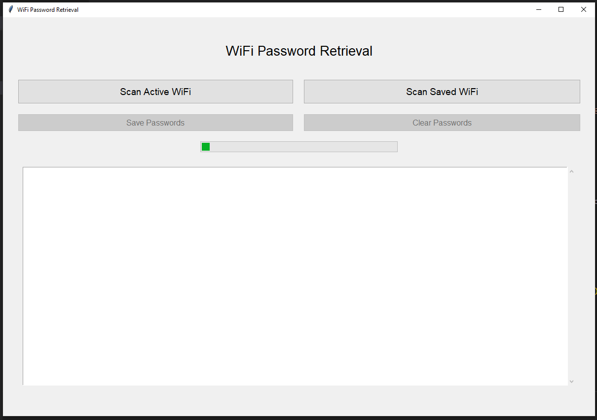

# WiFi Password Retrieval

This project provides a GUI application to retrieve the passwords of active and saved WiFi networks on a Windows system. The application uses the `netsh` command to fetch WiFi details and displays them in a user-friendly interface.

## Features

- Scan and display the password of the currently active WiFi network.
- Scan and display passwords of all saved WiFi networks.
- Save displayed passwords to a file.
- Clear the displayed passwords from the text area.

## Prerequisites

- Windows operating system.
- Python 3.6 or higher.

## Installation

1. **Clone the repository:**

    ```bash
    git clone https://github.com/yourusername/wifi-password-retrieval.git
    cd wifi-password-retrieval
    ```

2. **Create a virtual environment (optional but recommended):**

    ```bash
    python -m venv venv
    source venv/bin/activate # On Windows use `venv\Scripts\activate`
    ```

## Running the Application

To run the application, execute the following command:

```bash
python wifi_password_retrieval.py
```

This will open the GUI application.

## Usage

### 1.	Main GUI:
The main interface allows you to scan for the active WiFi network's password or all saved WiFi networks' passwords. You can also save the displayed passwords to a file or clear the text area.


### 2.	Active WiFi Network Password:
Click on the "Scan Active WiFi" button to fetch and display the password of the currently active WiFi network.

### 3.	Saved WiFi Networks Passwords:
Click on the "Scan Saved WiFi" button to fetch and display the passwords of all saved WiFi networks on your system.

### Saving Passwords
To save the displayed passwords to a file, click on the "Save Passwords" button. The passwords will be appended to a file named passwords.txt.

### Clearing Passwords
To clear the displayed passwords from the text area, click on the "Clear Passwords" button.

### License
This project is licensed under the MIT License. See the LICENSE file for more details.

### Contributing
Contributions are welcome! Please feel free to submit a Pull Request.


